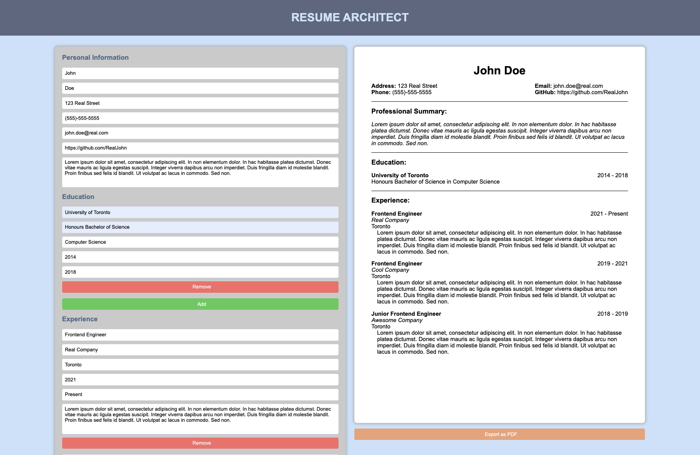

## Resume Architect

This is a resume building application that allows users to fill out and export their information from a template to PDF. This is my first ReactJS project and it uses functional components and hooks.

## Screenshot

### Built With

* [React.js](https://reactjs.org/)
* [Create React App](https://create-react-app.dev/)
* [JavaScript](https://www.javascript.com/)
* [uniqid](https://www.npmjs.com/package/uniqid)
* [jspdf](https://parall.ax/products/jspdf)

## Contact

Nelson M - https://www.linkedin.com/in/nelsonmieszkalski/

Project Link: [https://nelsonmn.github.io/cv-application/](https://nelsonmn.github.io/cv-application/)
